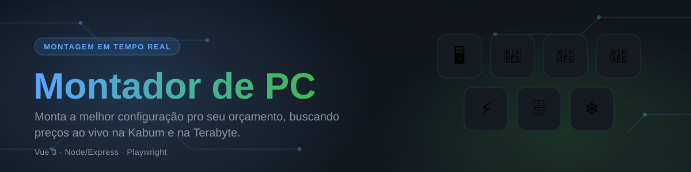

# buildpcserve

Backend (Node/Express) do Montador de PC. Busca preços em tempo real na
Kabum e na Terabyte e expõe duas rotas:

- `GET /api/build?budget=<valor>` — monta automaticamente a melhor
  configuração de PC dentro do orçamento informado.
- `GET /api/search?q=<termo>` — busca livre num termo, usada pelo modo
  "peça por peça" do frontend ([buildpcclient](https://github.com/GuilhermeFernando82/buildpcclient)).

## Como funciona

- **Kabum** (`kabum.js`): busca via HTTP simples e extrai os dados do JSON
  `__NEXT_DATA__` embutido no HTML — sem navegador, rápido.
- **Terabyte** (`stores/terabyte.js`): a loja usa um desafio JS da
  Cloudflare que bloqueia requisições HTTP simples, então essa busca roda
  num Chromium headless (Playwright, `browser.js`) e extrai os dados direto
  dos atributos `data-tss-*` de cada card de produto.
- `stores/index.js` busca as duas lojas em paralelo e junta tudo num único
  pool de produtos por categoria.
- `builder.js` distribui o orçamento entre 8 categorias (GPU, CPU,
  placa-mãe, RAM, SSD, fonte, gabinete, water cooler), escolhendo o melhor
  preço disponível em qualquer uma das lojas. Aplica heurísticas de
  compatibilidade (socket CPU↔placa-mãe, DDR da RAM↔placa-mãe, wattagem da
  fonte↔GPU) e recalcula essas dependências em cascata sempre que CPU ou GPU
  trocam de item durante o ajuste de orçamento.

## Rodando localmente

```bash
npm install
npx playwright install chromium   # baixa o Chromium do scraper da Terabyte (uma vez só)
npm start
```

Sobe em `http://localhost:3001`. Veja o
[buildpcclient](https://github.com/GuilhermeFernando82/buildpcclient) para
rodar o frontend apontando pra cá.

## Deploy (Railway ou Render)

1. Crie um serviço a partir deste repositório. O `Dockerfile` incluído usa a
   imagem oficial do Playwright (já traz o Chromium e as bibliotecas de
   sistema necessárias) e é detectado automaticamente — não precisa
   configurar build/start command na mão.
2. Nenhuma variável é obrigatória para funcionar; a porta vem de `PORT`,
   injetada pela plataforma.
3. Depois que o frontend estiver publicado (Vercel), defina a variável de
   ambiente `CORS_ORIGIN` com a URL dele (ex.:
   `https://seu-projeto.vercel.app`; aceita várias URLs separadas por
   vírgula) e faça redeploy.

A tag da imagem no `Dockerfile` (`v1.62.1-noble`) precisa bater com a versão
do pacote `playwright` no `package.json`. Se atualizar um, atualize o outro.

## Conferência de preço na página do produto

A listagem de busca das lojas às vezes serve dado velho. Na Terabyte dá para
ver: depois que um produto esgota, a busca continua devolvendo o último preço
e `estoque=1`, e o card fica idêntico ao de um produto disponível — não há como
perceber pela listagem.

Por isso `productPage.js` confere preço e estoque na página de cada peça que a
montagem escolheu (só as ~8, o pool inteiro seria inviável). Peça esgotada sai
do páreo, preço errado é corrigido, e a montagem é refeita — até duas vezes,
já que uma peça mais cara ou ausente muda o que cabe no orçamento.

Cada loja tem um caminho próprio: Kabum e Pato Loco respondem a HTTP comum, a
Terabyte só pelo navegador do Playwright (responde 403 ao resto). Vale notar
duas armadilhas encontradas ali, ambas silenciosas:

- `availability` do JSON-LD da Terabyte diz `InStock` mesmo em produto
  esgotado. O sinal confiável é o bloco `.prodEsgPreco` estar **visível**.
- Reaproveitar uma aba para várias páginas dela parece funcionar, mas da
  terceira navegação em diante o site devolve página sem dados, sem erro. Cada
  conferência abre seu próprio contexto por causa disso.

Os resultados ficam em cache por 10 minutos, então montagens seguidas não
repetem o trabalho.

## Links de afiliado

Os links de produto passam por `affiliate.js`, que acrescenta o código de
parceiro antes de o link chegar no usuário. Cada loja é ligada por uma variável
de ambiente — sem ela, o link sai exatamente como veio da loja. Os códigos
ficam só no ambiente, nunca no repositório.

| Variável | Loja |
| --- | --- |
| `AFFILIATE_KABUM` | Kabum |
| `AFFILIATE_TERABYTE` | Terabyte |
| `AFFILIATE_PATOLOCO` | Pato Loco |

Três formatos, conforme o que o programa fornecer:

- `param:<nome>:<valor>` — acrescenta um parâmetro na URL do produto. É o caso
  dos programas próprios das lojas e o da Amazon.
  Ex.: `param:ref:guilherme123`
- `awin:<awinmid>:<awinaffid>` — deep link da Awin, que intermedia várias lojas
  brasileiras. Os dois ids aparecem no painel da Awin.
  Ex.: `awin:12345:987654`
- `template:<url>` — para qualquer outra rede: cole o modelo de deep link do
  painel dela, com `{encoded}` onde entra a URL do produto (ou `{url}`, se
  aquela rede não pedir encode).
  Ex.: `template:https://redir.rede.com/?u={encoded}&id=42`

Com pelo menos uma configurada, `/api/health` passa a responder
`"affiliate": true` e o frontend exibe automaticamente o aviso de link
patrocinado — exigido pelos programas e pelo CONAR.

Uma variável com formato inválido é ignorada com aviso no log, para um erro de
digitação não virar link sem comissão silenciosamente. O `id` usado no
histórico de preço vem sempre da URL limpa, então ligar ou trocar o código de
afiliado não reinicia o histórico dos produtos.

## Sobre Pichau e Shopee (não incluídas)

- **Pichau**: também usa Cloudflare, mas com detecção de bot mais agressiva
  — mesmo o Chromium headless com patches de stealth
  (`navigator.webdriver`, plugins, etc.) é identificado como automação e
  recebe uma página de bloqueio disfarçada de "Site em Manutenção". O
  scraper está escrito em `stores/pichau.js` e funciona se a proteção mudar,
  mas hoje não passa. Não fui além disso (fingerprint de canvas/WebGL,
  proxies residenciais etc.) porque o site está deliberadamente sinalizando
  que não quer esse tipo de acesso automatizado.
- **Shopee**: a busca exige sessão logada e os Termos de Uso proíbem
  scraping explicitamente; além disso, por ser marketplace de vendedores
  variados, a nomenclatura dos anúncios é inconsistente demais para a lógica
  de compatibilidade deste projeto. Não tentei contornar o login.

## Limitações conhecidas

- **Duas fontes**: Kabum e Terabyte. Pode haver preço melhor em outras lojas
  não cobertas.
- **Scraping, não API oficial**: ambos os sites podem mudar a estrutura da
  página a qualquer momento e quebrar o parser. Não há SLA.
- **Compatibilidade por heurística**: como as listagens não trazem specs
  estruturadas, socket/DDR/wattagem são inferidos por palavras-chave no nome
  do produto.
- **Cache de 10 minutos** por categoria/termo/loja, em memória do processo
  (não persiste entre deploys nem é compartilhado entre instâncias).
- **Mais lento que só-Kabum**: a busca na Terabyte roda um navegador
  headless por categoria (até 4 em paralelo), então uma consulta "fria"
  (fora do cache) leva bem mais que uma busca só na Kabum.
